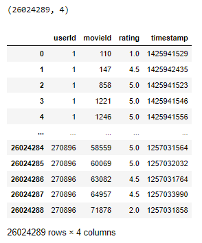
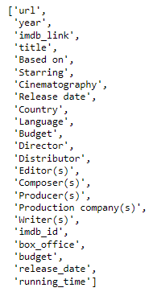

# Movies_ETL

Analyzing movies data from Wikipedia and Kaggle and building a robust ETL pipeline from different sources to a structured database.

## Background

The Amazing Prime analysis team is interested in understanding movies ratings, popularity. They proposed a project to analyze movies data from Wikipedia and Kaggle among other sources, and they intend to present this project as a hackathon event. 

The datasets provided are massive and contain all related information about motion picture production from 1999 till 2018.

To Keep the data updated on a daily basis, we propose creating an automated pipeline that takes in new data, performs the appropriate transformations, and loads the data into existing tables in a SQL database. 

### Purpose

Refactor Extraction, Transformation, and Loading code to create one function that takes in the three files—Wikipedia data, Kaggle metadata, and the MovieLens rating data—and performs the ETL process by adding the data to a PostgreSQL database.

## Resources
- Data Sources: movies_metadata.csv, ratings.csv, wikipedia-movies.json
- Softwares: Python, PostgreSQL, pgAdmin, Anaconda.
- Libraries & Packages: Jupyter Notebook, sqlAlchemy, psycogp2, 
- Online Tools: [Movies ETL Analysis GitHub Repository](https://github.com/Magzzie/Movies_ETL)

## Methods

1. Using Python, Pandas, the ETL process, and code refactoring, we created a function that readd in the three data files and creates three separate DataFrames.

2. Using Python, Pandas, the ETL process, and code refactoring, we extracted and transformed the Wikipedia data so we could merge it with the Kaggle metadata. While extracting the IMDb IDs using a regular expression string and dropping duplicates, we used a try-except block to catch errors.

3. Using Python, Pandas, the ETL process, and code refactoring, extract and transform the Kaggle metadata and MovieLens rating data, then converted the transformed data into separate DataFrames. Then, we merged the Kaggle metadata DataFrame with the Wikipedia movies DataFrame to create the movies_df DataFrame. Finally,  we merged the MovieLens rating data DataFrame with the movies_df DataFrame to create the movies_with_ratings_df.

4. Use Python, Pandas, the ETL process, code refactoring, and PostgreSQL, we added the movies_df DataFrame and MovieLens rating CSV data to a SQL database.

## Results
1. Reading data from CSV json files into three separate DataFrame.  

    ||
    |-|
    ||
    ||
    
2. ETL on the Wikipedia Movies data:  
    
    ||
    |-|
    ||
   
3.  ETL on the Kaggle Movies data:   

    ||
    |-|
    ||
    ||
    
4. Transferring transformed the merged Kaggle - Wiki movies data along with the raw Ratings data into a their own tables in a SQL database:  
    - We timed the import of Ratings data into the SQL database after creating a function to send it in chuncks.     
        ||
        |-|
    
    - We confirmed the success of the transfer by displaying and counting the rows in each table.  
    - The first set of images shows the merged Kaggle-Wiki data info.  
    
    ||
    |-|
    ||
    
    - The second set of images shows the imported raw Rating dataset.  
    
    ||
    |-|
    ||
    
    
---

